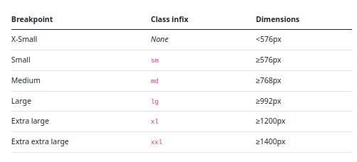

# Module 13: Responsive Layout Using Bootstrap

## Notes

* mx-auto --> Aligns center in X-axis
* CDN --> Content Delivery Network
* Bootstarp for Flexboxx is awesome!
* Bootstrap grid system is made from flexbox
* Bootstrap Breakpoints: 
* Containers: 

## Links

*

## Topic Discussed in Module

* Form
* Form floating label
* Form Layout
* Form Validation
* Modal/Dialog
* Offcanvas
* Flex --> d-flex
* Flex ordering --> order-$
* Breakpoint
* Grid

## Things to Explore

* Bootstrap Documentation
